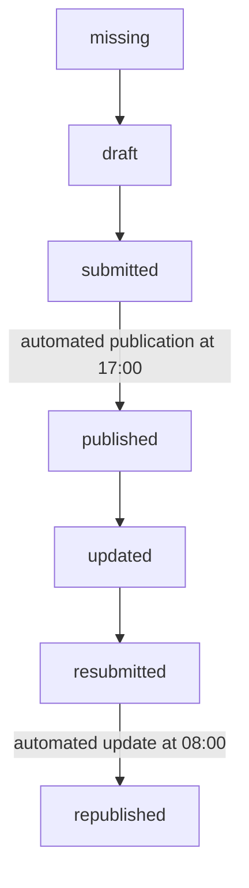

# albina-server

The server stores and processes all relevant information for the ALBINA system such as bulletins.

## Bulletin status/workflow

```mermaid
flowchart TD
missing --> draft --> submitted -->|automated publication at 17:00| published --> updated --> resubmitted -->|automated update at 08:00| republished
```
