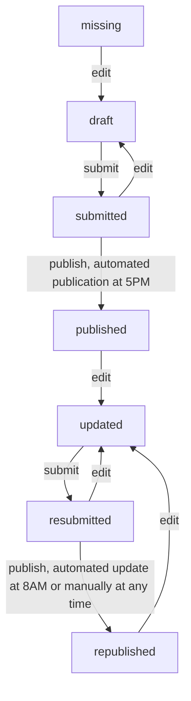

# albina-server

The server stores and processes all relevant information for the ALBINA system such as bulletins.

## Bulletin status/workflow



## Translations

This project uses Transifex for its translations: https://app.transifex.com/albina-euregio/albina-server/dashboard/


## Database Migrations
Database migrations are handled by Liquibase. To activate automatic deployment of new changesets,
make sure that you have the environment variable
`ALBINA_DB_RUN_MIGRATION` set to `true`.

### Liquibase for Automatic Database Migrations

1. Apply appropriate hibernate annotations in Java source
2. Generate liquibase changesets (Note: You can also skip steps ii. and iii. and just write the changeset yourself):
   1. extend `resources/hibernate.cfg.xml` if necessary
   2. `mvn compile`
   3. `mvn liquibase:diff` --> this generates the file `resourcees/db/generated_changelog.mariadb.sql`
   4. check the contents of the file and adapt if necessary. Once you are satisfied, rename it and move into appropriate sub-folder under `resources/db`
3. Deploy changesets in your local test environment:
   1. run `mvn liquibase:update`, or,
   2. check that `ALBINA_DB_RUN_MIGRATION=true` and start local server with `mvn jetty:run`
4. Commit changes to Java source and liquibase changesets together.

### Tips
- If you only want changes for a specific table of the database you can use `diffIncludeObjects`. E.g.
` mvn liquibase:diff -Dliquibase.diffIncludeObjects="regions"`
- The JPA Buddy plugin for Intellij (Ultimate) provides nice GUI features for automatic changeset generation.
  You can specify a connection to your development database and it will detect when columns are missing and automatically
  suggest to generate changesets.
- It is a best practice to specify only one type of change per changeset. Doing so avoids failed auto-commit statements
that can leave the database in an unexpected state. When you deploy your changes, each changeset either succeeds or fails;

## Update CHANGELOG (for new releases)

[git-cliff](https://git-cliff.org/docs/) needs to be installed on your system.

Please use the following workflow when releasing new versions:

1. determine new version number `<TAG>` and
   run `git-cliff -u -p CHANGELOG.md -t <TAG>`
2. edit `CHANGELOG.md` by hand if necessary and commit
3. create `<TAG>` with git

If you forgot to update the changelog before creating a new tag in git, use
`git-cliff -l -p CHANGELOG.md`. This will add all commits for the
**latest** tag to the CHANGELOG. The downside compared to the workflow above is, that the
changes to CHANGELOG itself are not included in the release.

If there have been several new releases since the last update to CHANGELOG,
use e.g. `git-cliff -p CHANGELOG.md v7.0.6..` to prepend all changes that
happened *after* version v7.0.6 was released.

## Development Setup

The `env-local` profile defined in _pom.xml_ is used to configure the server for local development.
Follow these steps to set up and run the server locally.

1. Ensure that a database with the appropriate schema and entries is accessible on port 3306. If the database is hosted remotely and requires an SSH tunnel, use the following command to set up the connection:

```bash
ssh example-server -L 3306:localhost:3306
```

2. Start the server:

```bash
mvn jetty:run
```

3. Once the server is running, you can access and test the API by navigating to: http://0.0.0.0:8080/albina/
