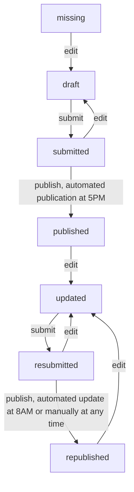

# albina-server

The server stores and processes all relevant information for the ALBINA system such as bulletins.

## Bulletin status/workflow

## Translations

This project uses Transifex for its translations: https://app.transifex.com/albina-euregio/albina-server/dashboard/

## Update CHANGELOG (for new releases)

[git-cliff](https://git-cliff.org/docs/) needs to be installed on your system.

Please use the following workflow when releasing new versions:

1. determine new version number `<TAG>` and
   run `git-cliff -u -p CHANGELOG.md -t <TAG>`
2. edit `CHANGELOG.md` by hand if necessary and commit
3. create `<TAG>` with git

If you forgot to update the changelog before creating a new tag in git, use
`git-cliff -l -p CHANGELOG.md`. This will add all commits for the
**latest** tag to the CHANGELOG. The downside compared to the workflow above is, that the
changes to CHANGELOG itself are not included in the release.
