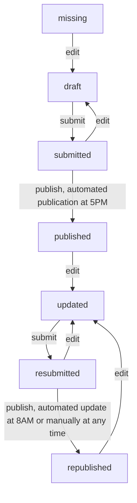

# albina-server

The server stores and processes all relevant information for the ALBINA system such as bulletins.

## Bulletin status/workflow



## Translations

This project uses Transifex for its translations: https://app.transifex.com/albina-euregio/albina-server/dashboard/

## Development Setup

The `env-local` profile defined in _pom.xml_ is used to configure the server for local development.
Follow these steps to set up and run the server locally.

1. Ensure that a database with the appropriate schema and entries is accessible on port 3306. If the database is hosted remotely and requires an SSH tunnel, use the following command to set up the connection:

```bash
ssh example-server -L 3306:localhost:3306
```

2. Start the server:

```bash
mvn jetty:run
```

3. Once the server is running, you can access and test the API by navigating to: http://0.0.0.0:8080/albina/
