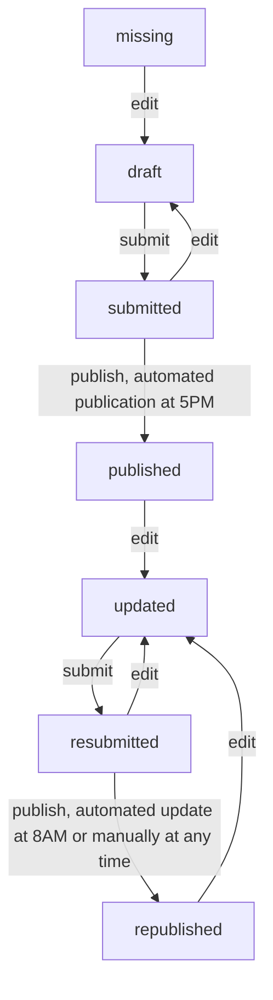

# albina-server

The server stores and processes all relevant information for the ALBINA system such as bulletins.

## Bulletin status/workflow



## Translations

This project uses Transifex for its translations: https://app.transifex.com/albina-euregio/albina-server/dashboard/

## Deployment

```shell
# install requirements
apt/dnf install java-21-openjdk-headless ghostscript imagemagick webp
# build
# or download build artifact from GitLab: https://gitlab.com/albina-euregio/albina-server/-/pipelines?scope=tags
mvn versions:set -DgenerateBackupPoms=false -DnewVersion=$(git describe --tags)
mvn clean package
# prepare server
adduser albina-server
mkdir /opt/albina-server/
mkdir /opt/albina-server/tomcat.8080/
mkdir /var/www/static-albina.example.com/
mkdir /var/www/static-albina.example.com/bulletins/
mkdir /var/www/static-albina.example.com/simple/
mkdir /var/www/static-albina.example.com/images/
mkdir /var/www/static-albina.example.com/media_files/
sudo chown --recursive albina-server:albina-server /opt/albina-server/
sudo chown --recursive albina-server:albina-server /var/www/static-albina.example.com/
# copy to /opt/albina-server/albina.jar on server
scp target/albina*.jar albina.example.com:/opt/albina-server/albina.jar
# start systemd service
sudo systemctl restart albina-server.service
# enable systemd service (start after reboot)
sudo systemctl enable albina-server.service
# logging to stdout (no log files), use `journalctl` to view the logs:
journalctl --unit albina-server.service
journalctl --unit albina-server.service --follow --lines 100
```

```properties
# /etc/systemd/system/albina-server.service
[Unit]
After=syslog.target network.target

[Install]
WantedBy=multi-user.target

[Service]
Environment=JDBC_URL=jdbc:mariadb://localhost:3306/albina_dev?useSSL=false&useUnicode=true&useJDBCCompliantTimezoneShift=true&useLegacyDatetimeCode=false&serverTimezone=UTC
Environment=JDBC_USER=...
Environment=JDBC_PASSWORD=...
Environment=JWT_GENERATOR_SIGNATURE_SECRET=...
Environment=MICRONAUT_SERVER_PORT=8080
Environment=UMASK=0022
ExecStartPre=/usr/bin/mkdir -p tomcat.8080/work/Tomcat/localhost/albina#api
ExecStart=/usr/lib/jvm/jre-21/bin/java -jar albina.jar
Type=simple
User=albina-server
WorkingDirectory=/opt/albina-server/
```

Configure [Caddy server](https://caddyserver.com/) as reverse proxy:

```
# /etc/caddy/Caddyfile
api.example.com {
	reverse_proxy "localhost:8081"
	log
	encode zstd gzip
}
```

Configure server instance, region and admin user in database:

```sql
INSERT INTO server_instances
(ID, API_URL, EXTERNAL_SERVER, HTML_DIRECTORY, MAP_PRODUCTION_URL, MAPS_PATH, MEDIA_PATH, NAME, PASSWORD, PDF_DIRECTORY, PUBLISH_AT_5PM, PUBLISH_AT_8PM, SERVER_IMAGES_URL, USER_NAME, DANGER_LEVEL_ELEVATION_DEPENDENCY)
VALUES(1, 'https://api-albina.example.com/albina/api/', 0, '/var/www/static-albina.example.com/simple', '/opt/avalanche-warning-maps', '/var/www/static-albina.example.com/bulletins', '/var/www/static-albina.example.com/media_files', 'api-albina.example.com', '', '/var/www/static-albina.example.com/bulletins', 0, 0, 'https://static-albina.example.com/images/', 'albina@example.com', 1);

INSERT INTO regions
(ID, CREATE_CAAML_V5, CREATE_CAAML_V6, CREATE_JSON, CREATE_MAPS, CREATE_PDF, CREATE_SIMPLE_HTML, EMAIL_COLOR, ENABLE_MEDIA_FILE, GEO_DATA_DIRECTORY, IMAGE_COLORBAR_BW_PATH, IMAGE_COLORBAR_COLOR_PATH, MAP_LOGO_BW_PATH, MAP_LOGO_COLOR_PATH, MAP_LOGO_POSITION, MICRO_REGIONS, PDF_COLOR, PDF_FOOTER_LOGO, PDF_FOOTER_LOGO_BW_PATH, PDF_FOOTER_LOGO_COLOR_PATH, PDF_MAP_HEIGHT, PDF_MAP_WIDTH_AM_PM, PDF_MAP_WIDTH_FD, PDF_MAP_Y_AM_PM, PDF_MAP_Y_FD, PUBLISH_BLOGS, PUBLISH_BULLETINS, SEND_EMAILS, SEND_PUSH_NOTIFICATIONS, SEND_TELEGRAM_MESSAGES, SIMPLE_HTML_TEMPLATE_NAME, SERVER_INSTANCE_ID, SHOW_MATRIX, ENABLE_AVALANCHE_PROBLEM_CORNICES, ENABLE_AVALANCHE_PROBLEM_NO_DISTINCT_AVALANCHE_PROBLEM, ENABLE_OBSERVATIONS, ENABLE_MODELLING, ENABLE_STRATEGIC_MINDSET, ENABLE_WEATHERBOX, ENABLE_STRESS_LEVEL, ENABLE_DANGER_SOURCES, SEND_WHATSAPP_MESSAGES, ENABLED_LANGUAGES, TTS_LANGUAGES, ENABLE_GENERAL_HEADLINE, ENABLE_WEATHER_TEXT_FIELD, COAT_OF_ARMS, DEFAULT_LANG, LOGO_PATH, LOGO_BW_PATH, STATIC_URL, ENABLED_EDITABLE_FIELDS)
VALUES('XA', 1, 1, 1, 1, 1, 1, '1AABFF', 0, 'geodata.Aragon/', 'logo/grey/colorbar.gif', 'logo/color/colorbar.gif', '', '', 'bottomright', 15, '00ACFB', 0, 'logo/grey/avalanche_report.png', 'logo/color/avalanche_report.png', 270, 270, 420, 130, 250, 0, 1, 0, 0, 0, 'simple-bulletin.html', 1, 1, 0, 0, 0, 0, 0, 0, 0, 0, 0, 'de,it,en,fr,es,ca,oc', '', 0, 0, '', 'en', 'logo/color/avalanche_report.png', 'logo/grey/avalanche_report.png', 'https://static-albina.example.com', '');

INSERT INTO region_language_configurations
(REGION_ID, LANGUAGE_CODE, URL, URL_WITH_DATE, WARNING_SERVICE_EMAIL, WARNING_SERVICE_NAME, WEBSITE_NAME)
VALUES('XA', 'en', 'https://albina.example.com', 'https://albina.example.com/bulletin/%s', 'albina@example.com', 'albina.example.com', 'albina.example.com');

INSERT INTO users
(EMAIL, IMAGE, NAME, ORGANIZATION, PASSWORD, LANGUAGE_CODE, DELETED)
VALUES('albina@example.com', NULL, 'albina.example.com', NULL, NULL, NULL, 0);

-- https://bcrypt-generator.com/ → $2a$10$...

INSERT INTO users
(EMAIL, IMAGE, NAME, ORGANIZATION, PASSWORD, LANGUAGE_CODE, DELETED)
VALUES('admin@example.com', NULL, 'Admin Admin', 'Admin', '$2a$10$...', NULL, 0);

INSERT INTO user_role
(USER_EMAIL, USER_ROLE)
VALUES('admin@example.com', 'ADMIN');

INSERT INTO user_region
(USER_EMAIL, REGION_ID)
VALUES('admin@example.com', 'XA');
```

## Database Migrations

Database migrations are handled by Liquibase, and are enabled by default via `liquibase.datasources.default.change-log=classpath\:db/changelog-main.xml`

### Liquibase for Automatic Database Migrations

1. Apply appropriate hibernate annotations in Java source
2. Generate liquibase changesets (Note: You can also skip steps ii. and iii. and just write the changeset yourself):
   1. extend `resources/hibernate.cfg.xml` if necessary
   2. `mvn compile`
   3. `mvn liquibase:diff` --> this generates the file `resourcees/db/generated_changelog.mariadb.sql`
   4. check the contents of the file and adapt if necessary. Once you are satisfied, rename it, update the lines `-- changeset albina:000_000000 failOnError:true` accordingly, and move into appropriate sub-folder under `resources/db`
3. Deploy changesets in your local test environment:
   1. run `mvn compile` followed by `mvn liquibase:update`, or,
   2. just start the local server with `mvn mn:run`
4. Commit changes to Java source and liquibase changesets together.

### Tips

- If you only want changes for a specific table of the database you can use `diffIncludeObjects`. E.g.
  ` mvn liquibase:diff -Dliquibase.diffIncludeObjects="regions"`
- similarly, `diffExcludeObjects` can be used to ignore tables
- use `mvn liquibase:status` to check what changes will be applied before you run `mvn liquibase:update`
- The JPA Buddy plugin for Intellij (Ultimate) provides nice GUI features for automatic changeset generation.
  You can specify a connection to your development database and it will detect when columns are missing and automatically
  suggest to generate changesets.
- It is a best practice to specify only one type of change per changeset. Doing so avoids failed auto-commit statements
  that can leave the database in an unexpected state. When you deploy your changes, each changeset either succeeds or fails;

## Update CHANGELOG (for new releases)

[git-cliff](https://git-cliff.org/docs/) needs to be installed on your system.

Please use the following workflow when releasing new versions:

1. determine new version number `<TAG>` and
   run `git-cliff -u -p CHANGELOG.md -t <TAG>`
2. edit `CHANGELOG.md` by hand if necessary and commit
3. create `<TAG>` with git

If you forgot to update the changelog before creating a new tag in git, use
`git-cliff -l -p CHANGELOG.md`. This will add all commits for the
**latest** tag to the CHANGELOG. The downside compared to the workflow above is, that the
changes to CHANGELOG itself are not included in the release.

If there have been several new releases since the last update to CHANGELOG,
use e.g. `git-cliff -p CHANGELOG.md v7.0.6..` to prepend all changes that
happened _after_ version v7.0.6 was released.

## Development Setup

The `env-local` profile defined in _pom.xml_ is used to configure the server for local development.
Follow these steps to set up and run the server locally.

1. Ensure that a database with the appropriate schema and entries is accessible on port 3306. If the database is hosted remotely and requires an SSH tunnel, use the following command to set up the connection:

```bash
ssh example-server -L 3306:localhost:3306
```

2. Start the server:

```bash
mvn mn:run
```

3. Once the server is running, you can access the API by navigating to: http://0.0.0.0:8080/albina/api

## Micronaut 4.9.2 Documentation

- [User Guide](https://docs.micronaut.io/4.9.2/guide/index.html)
- [API Reference](https://docs.micronaut.io/4.9.2/api/index.html)
- [Configuration Reference](https://docs.micronaut.io/4.9.2/guide/configurationreference.html)
- [Micronaut Guides](https://guides.micronaut.io/index.html)

---

- [Micronaut Maven Plugin documentation](https://micronaut-projects.github.io/micronaut-maven-plugin/latest/)

## Micronaut Data

Micronaut Data is a database access toolkit that uses Ahead of Time (AoT) compilation to pre-compute queries for repository interfaces that are then executed by a thin, lightweight runtime layer.

- [Guide](https://micronaut-projects.github.io/micronaut-data/latest/guide/)

## Feature liquibase documentation

- [Micronaut Liquibase Database Migration documentation](https://micronaut-projects.github.io/micronaut-liquibase/latest/guide/index.html)

- [https://www.liquibase.org/](https://www.liquibase.org/)

## Feature tomcat-server documentation

- [Micronaut Tomcat Server documentation](https://micronaut-projects.github.io/micronaut-servlet/latest/guide/index.html#tomcat)

## Feature maven-enforcer-plugin documentation

- [https://maven.apache.org/enforcer/maven-enforcer-plugin/](https://maven.apache.org/enforcer/maven-enforcer-plugin/)

## Feature jul-to-slf4j documentation

- [https://www.slf4j.org/legacy.html#jul-to-slf4jBridge](https://www.slf4j.org/legacy.html#jul-to-slf4jBridge)

## Feature jdbc-hikari documentation

- [Micronaut Hikari JDBC Connection Pool documentation](https://micronaut-projects.github.io/micronaut-sql/latest/guide/index.html#jdbc)

## Feature serialization-jackson documentation

- [Micronaut Serialization Jackson Core documentation](https://micronaut-projects.github.io/micronaut-serialization/latest/guide/)

## Feature micronaut-aot documentation

- [Micronaut AOT documentation](https://micronaut-projects.github.io/micronaut-aot/latest/guide/)

## Feature jackson-xml documentation

- [Micronaut Jackson XML serialization/deserialization documentation](https://micronaut-projects.github.io/micronaut-jackson-xml/latest/guide/index.html)

- [https://github.com/FasterXML/jackson-dataformat-xml](https://github.com/FasterXML/jackson-dataformat-xml)

## Feature hibernate-jpa documentation

- [Micronaut Hibernate JPA documentation](https://micronaut-projects.github.io/micronaut-sql/latest/guide/index.html#hibernate)
